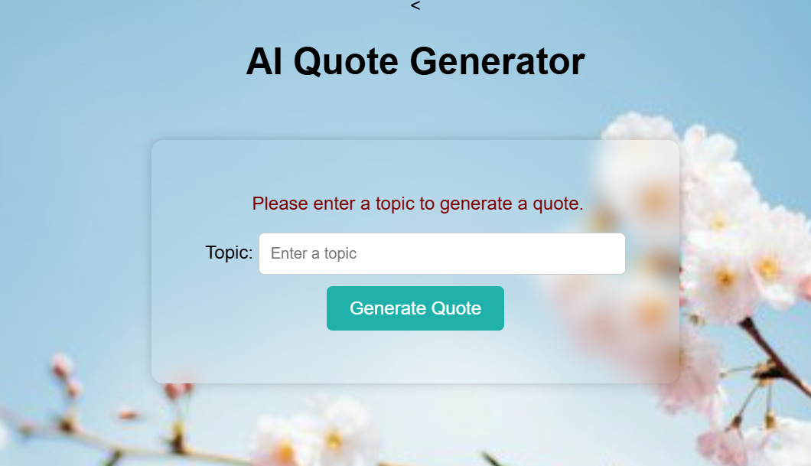
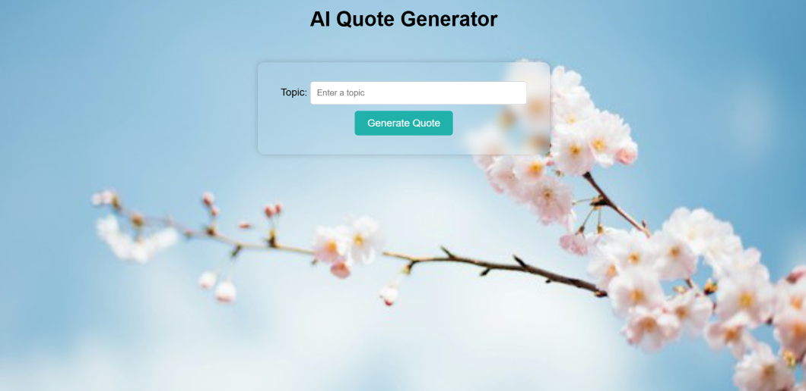
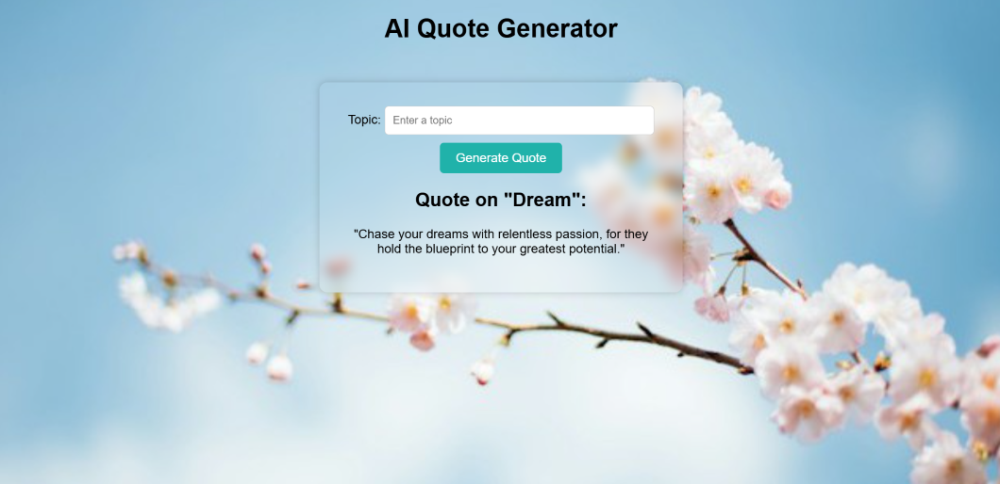
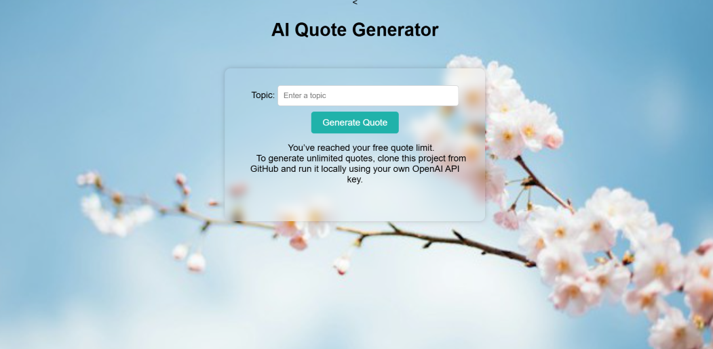

# 🌟 AI Quote Generator (Spring Boot + Spring AI)

This is a simple web app that generates motivational quotes using OpenAI's GPT model via **Spring AI**. Users can enter a topic and get a quote — limited to 1 free generation per IP.

## 🚀 Features
- Java 17, Spring Boot 3
- Spring AI (OpenAI Integration)
- Thymeleaf HTML template
- Styled with CSS
- Free quote for every user (IP-based limit)
- Environment-based API key (🔒 secure)

## 📸 Screenshot

## 🧪 Test it Locally

1. Clone this repo:
 
   git clone https://github.com/shruthipillala/ai-quote-generator.git
   cd ai-quote-generator

2. Add your OpenAI API key as an environment variable:
    export OPENAI_API_KEY=sk-xxxxxxx
    
3. Run the app
Then go to http://localhost:8080

## 🛠️ Technologies Used
- Java 17
- Spring Boot
- Spring AI
- Thymeleaf
- CSS
- HTML
- Render (for deployment)

## 🌐 Live Demo

